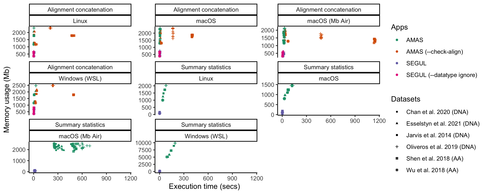
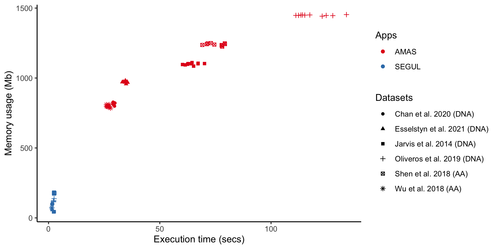
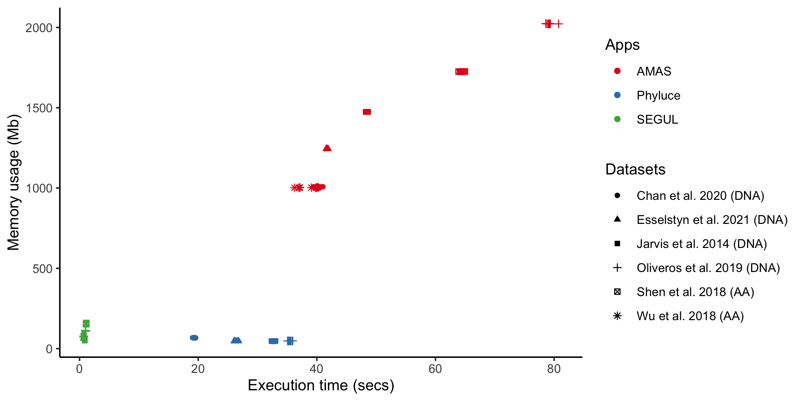
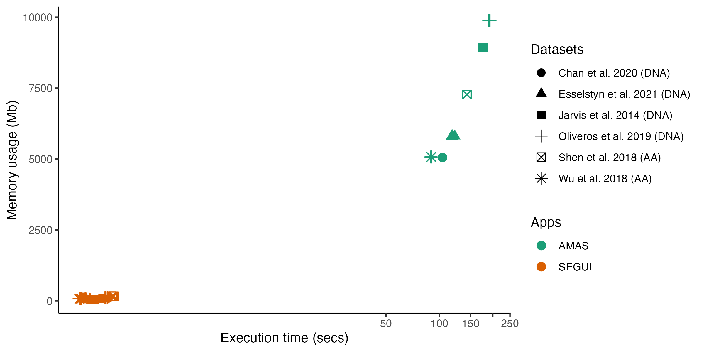
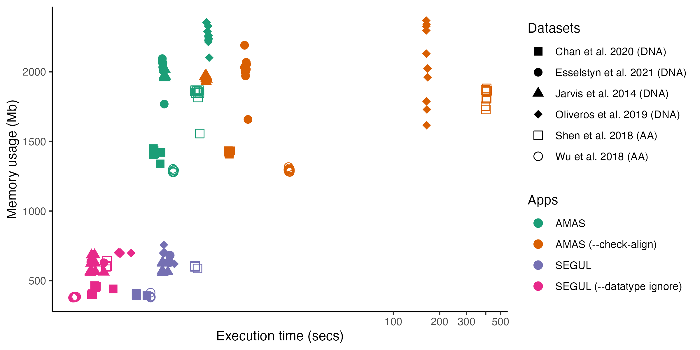
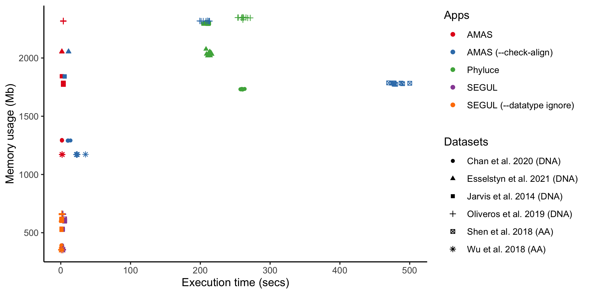
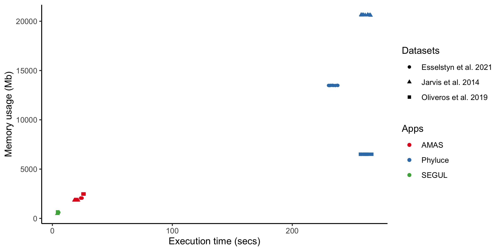
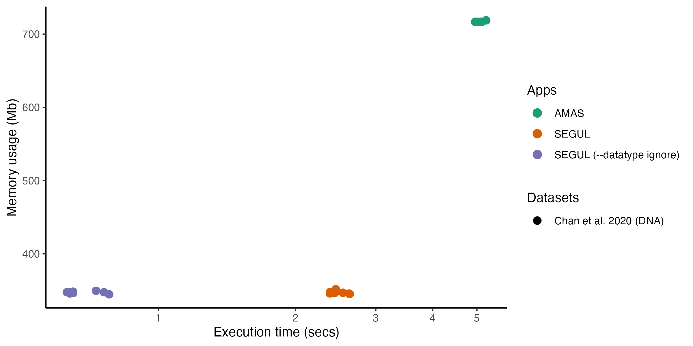

# segul-bench

This repo hosts benchmark results that compare [SEGUL](https://github.com/hhandika/segul) performance with other similar programs. The main focus is comparing to AMAS. AMAS is the fastest app available for alignment manipulation and generating alignment summary statistics (see [Borowiec, 2016](https://peerj.com/articles/1660/)). We also include Phyluce for some benchmark out of curiosity. It is not necessarily similar app, but has some overlap functions with SEGUL.

The benchmark is conducted in three different computer system. For Windows, we benchmark on Windows Subsystem for Linux because it tends to be the default choice when using bioinformatics command-line application.

## Results

## All Benchmark

## Per operating system benchmark

### Summary statistics

#### Benchmark 1

Test bench: MacMini (M1 2020)

OS: macOS Monterey v12.1

#### Benchmark 2

Test bench: Desktop PC

OS: openSUSE Tumbleweed x86_64

#### Benchmark 3

Test bench: Desktop PC

OS: Ubuntu 20.04.3 LTS on Windows 11 21H2 build 22000.406

### Concat statistics

#### Benchmark 1

Test bench: MacMini (M1 2020)

OS: macOS Monterey v12.1

#### Benchmark 2

Test bench: Desktop PC

OS: openSUSE Tumbleweed x86_64

#### Benchmark 3

Test bench: Desktop PC

OS: Ubuntu 20.04.3 LTS on Windows 11 21H2 build 22000.406

### Alignment Splitting

Test bench: Desktop PC

OS: openSUSE Tumbleweed x86_64

