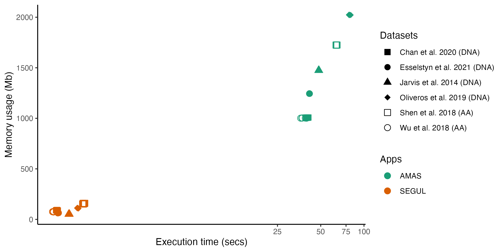
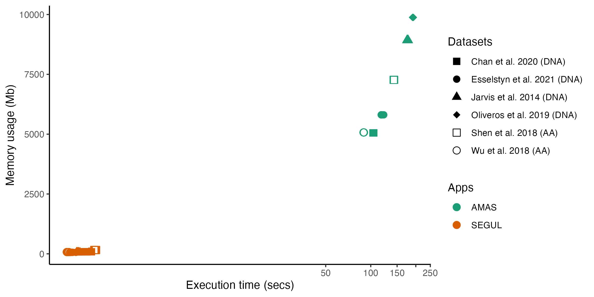
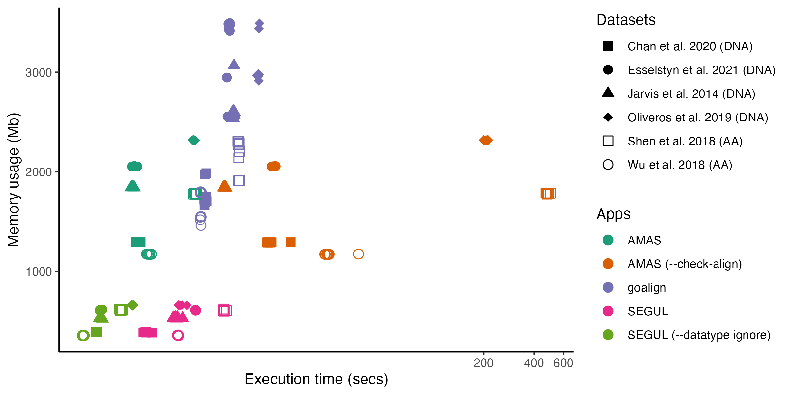
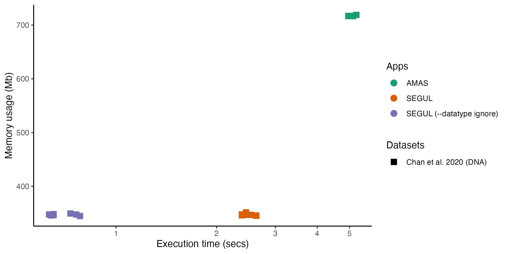

# segul-bench

This repo hosts benchmark results that compare [SEGUL](https://github.com/hhandika/segul) performance with other similar programs. The main focus is comparing to AMAS. AMAS is the fastest app available for alignment manipulation and generating alignment summary statistics (see [Borowiec, 2016](https://peerj.com/articles/1660/)). We also include [Phyluce](https://github.com/faircloth-lab/phyluce) for some benchmarks out of curiosity. It is not quite similar app because Phyluce does more than SEGUL, but has some overlap functions.

The benchmark is conducted in all three major operating system (Linux, macOS, and Windows). For Windows, we benchmark on Windows Subsystem for Linux because it tends to be the default choice when using bioinformatics command-line application.

## Results

### Summary statistics

#### Benchmark 1

Test bench: MacMini (M1 2020)

OS: macOS Monterey v12.1

#### Benchmark 2

Test bench: Desktop PC (AMD Ryzen 3900x)

OS: openSUSE Tumbleweed x86_64

#### Benchmark 3

Test bench: Desktop PC (AMD Ryzen 3900x)

OS: Ubuntu 20.04.3 LTS on Windows 11 21H2 build 22000.406

### Concat statistics

#### Benchmark 1

Test bench: MacMini (M1 2020)

OS: macOS Monterey v12.1

#### Benchmark 2

Test bench: Desktop PC (AMD Ryzen 3900x)

OS: openSUSE Tumbleweed x86_64

#### Benchmark 3

Test bench: Desktop PC (AMD Ryzen 3900x)

OS: Ubuntu 20.04.3 LTS on Windows 11 21H2 build 22000.406

### Alignment Splitting

Test bench: Desktop PC (AMD Ryzen 3900x)

OS: openSUSE Tumbleweed x86_64

